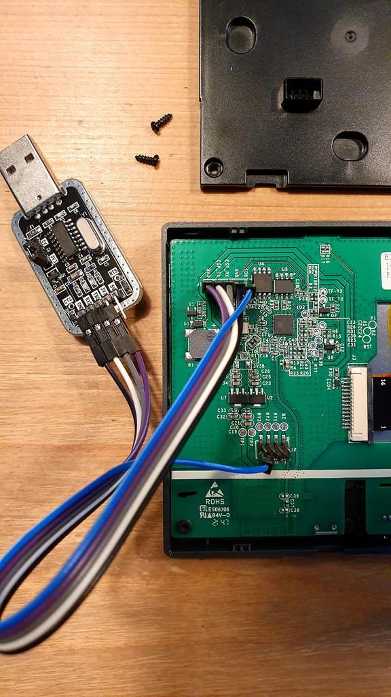

# Sonoff NSPanel HMI with ESPHome
Customisation of the ITEAD Sonoff NSPanel.  
This document is still a work in progress and updated as I learn. As a result this document is likely to be incomplete and may not show the best way to program this device.

> Feel free to comment and/or contribute

| Folder | Description |
|-|-|
| /bootstrap | Demo files for flashing the NSPanel with esphome and simple screen interface |
| /nextion-hmi | My implementation of the esphome-powered NSPanel, mounted on the wall in my hallway. It may serve as inspiration to others. |

## Background

In November 2021, Sonoff (ITEAD) released their NSPanel smart wall-mounted switch after completing a successfull campaign on Kickstarter (6783% funded).  

The device is powered by an Espressif ESP32 and features a `Nextion NX4832F035_011` display.

# Flashing ESP32 with ESPHome
## Words of caution!
> The ESP32 accepts 3.3v and (according docs) **IS NOT** 5V tolerant, so be sure to use a 3.3V programmer, or make sure the programmer is set to 3.3v if it is one of those that allow for selecting 3.3V/5V.  
> Powering it with 5v **will** fry the ESP32.

> Below the PCB is a metal plate, be sure to keep the header-pins that connect to the unpopulated programming headers short and avoid touching it!

## Programming
To put ESP32 in firmware programming mode, ground IO0 before powering the chip.



[TODO: Detailed description of flashing process]

# Nextion editor
In the EU model of the NSPanel, ~32pixels of the Nextion display is covered by the right-side bezel. This needs to be taken into account when designing the interface.   

The EU panel also has an offset in the touch panel.  
This can be corrected by including `lcd_dev fffb 0002 0000 0020` the line in `program.cs`. Note: this needs to be added before page selection `page 0`

```c
int sys0=0,sys1=0,sys2=0     //At present, the definition of global variable only supports 4-byte signed integer (int), and other types of global quantity declaration are not supported. If you want to use string type, you can use variable control in the page to implement
lcd_dev fffb 0002 0000 0020 // fix LCD touch offset error
page 0                       //Power on start page 0

```
# References
|||
|-|-|
| **YouTube** ||
| Flashing the Sonoff NSPanel with ESPHome |https://youtu.be/Kdf6W_Ied4o|
| Synchornised button states | https://community.home-assistant.io/t/nspanel-with-custom-gui-and-synchronized-button-states/377153 |
| How to get a custom UI for Home Assistant! |https://youtu.be/Kdf6W_Ied4o|
| How to turn off the screen when you're not using it| https://youtu.be/zndPIPLRjb8 |
| Dimming, sleep, and touch calibration | https://youtu.be/aNVGZDUKtuI |
| **Webpages** | |
|The Nextion Instruction Set|https://nextion.tech/instruction-set/|
| Blakadder NSPanel Hacking| https://blakadder.com/nspanel-hacking/|
